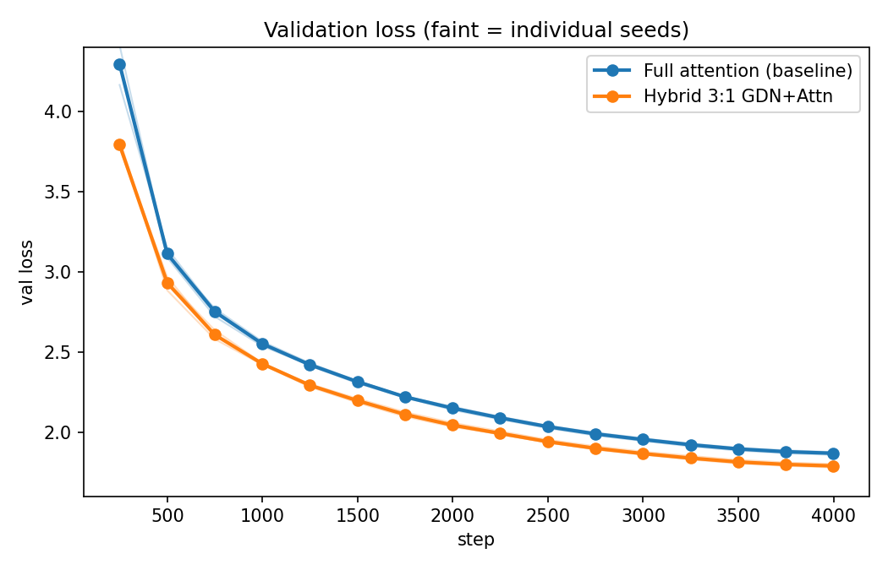
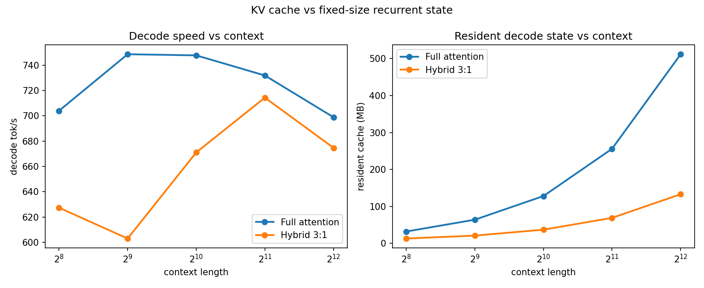

# nano-hybrid

A from-scratch, paired experiment: **full-attention Transformer vs. 3:1 GatedDeltaNet hybrid** at ~15M parameters, trained and benchmarked natively on Windows.

[中文说明](README.zh-CN.md)



Two models, same everything — data order, eval subset, hyperparameters, 4000 steps on TinyStories with a 4096-token BPE vocab:

- **gpt**: 8 × gated attention blocks (RoPE, GQA, per-head q/k RMSNorm, SwiGLU)
- **hybrid**: 3:1 Gated DeltaNet + gated attention, Qwen3-Next style layout

## Findings

3 paired seeds, verified end-to-end:

| Metric | gpt | hybrid |
|---|---|---|
| val loss (mean ± std, 3 seeds) | 1.868 ± 0.007 | **1.789 ± 0.009** |
| resident decode cache @4096 ctx | 512 MB | **133 MB** (~3.9×) |
| decode throughput | ~700 tok/s | ~700 tok/s |

1. **The hybrid wins on quality** — consistently better val loss on every seed, at every eval point.
2. **The hybrid wins on memory** — decode cache grows at ~1/4 the slope, exactly matching the attention-layer fraction (2/8 vs 8/8 layers keep KV state).
3. **Honest negative**: at this scale there is **no decode-speed advantage**. After replacing naive `torch.cat` cache growth with preallocated KV buffers, both models sit at ~700 tok/s — the earlier dramatic gap was a copy artifact, not an architectural property. Bandwidth-bound differences don't materialize until larger models / longer contexts / fused kernels.
4. **Honest cost**: the hybrid trains ~30% slower — its delta-rule path is plain PyTorch while baseline attention uses fused SDPA.



## What this is NOT

- Not a usable language model. At 15M parameters on TinyStories it writes toddler-level stories (grammatical, plot-adjacent, logically incoherent).
- Not a reproduction of fused-kernel performance. Everything here is plain PyTorch — no Triton, no CUDA graphs.
- Not a claim about long-context quality: training ctx is 256 tokens; anything past that is extrapolation.

## Reproduce

```
pip install -r requirements.txt
python -m nanohybrid.prepare_data          # downloads TinyStories, trains 4096-BPE tokenizer
python -m nanohybrid.train --arch gpt      # or hybrid; ~15 min/4000 steps on a 12GB GPU
python -m nanohybrid.bench_decode          # throughput + resident-cache curves
python -m nanohybrid.plot_results          # regenerates docs/figures/
python -m nanohybrid.generate --arch hybrid --prompt "Once upon a time" --tokens 150
```

`smoke_test.py` asserts chunk-vs-recurrent equivalence, prefill→decode cache consistency, and generation — a real check, not a print-fest.

## Upstream side effect

Attempting to ONNX-export the hybrid model surfaced a missing converter in `torch.onnx`: `aten::linalg_solve_triangular` (used by the Gated DeltaNet chunked prefill). Reported and fixed upstream → [microsoft/onnxscript#3055](https://github.com/microsoft/onnxscript/pull/3055).

## Environment

Tested on Windows 11 + Python 3.12 + PyTorch 2.x (CUDA 13) + RTX 5070 Ti (sm_120). Also runs under WSL2.

## License

MIT
